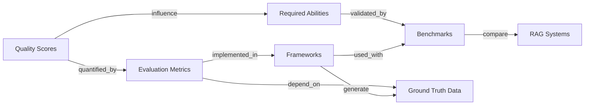

## TL;DR

!!! sam
    **evaluation | info flow**:

    1. ***[[#5.1-Quality-Scores]]*** define what to measure

    2. ***[[#5.2-Evaluation-Metrics]]*** quantify those meanings

    3. ***[[#5.3-Frameworks]]*** implement the measurements

    4. ***[[#5.4-Benchmarks]]*** provide standardized datasets for comparison

    5. ***[[#5.5-Abilities]]*** represent RAG capabilities validated through benchmarks

    Use *frameworks* and *evaluation metrics* to evaluate the *3 quality scores* and *4 abilities*. Compare against *benchmarks*.

  

***Quality Scores*** (Goals)

- <abbr title="For a given query, how relevant is the retrieved info from KB?">Context relevance</abbr>

- <abbr title="Is LLM using the retrieved info?">Answer faithfulness</abbr>

- <abbr title="For a given query, how relevant is the system's answer?">Answer relevance</abbr>
  

  

***Evaluation Metrics*** (Formulas)

- Retrieval Metrics

- RAG-Specific Metrics (Quality Scores)
  

  

***Frameworks*** (Tools)

- <abbr title="Retrieval-Augmented Generation Assessment">RAGAs</abbr>

- <abbr title="Automated RAG evaluation system">ARES</abbr>

- TruLens / DeepEval / RAGChecker

- Ground Truth Generation
  

  

***Benchmarks*** (Datasets)

- <abbr title="Examples include SQuAD | HotpotQA | BEIR">Classical QA</abbr>

- <abbr title="Examples include RGB | Multi-hop RAG | CRAG">RAG-Specific</abbr>

- <abbr title="Examples include MedRAG | CRUD-RAG | FeB4RAG">Domain-Specific</abbr>
  

  

***Required abilities*** (Properties)

- <abbr title="Among KB docs related to Q, only want actionable ones.">Noise robustness</abbr>

- <abbr title="If KB doesn't have relevant info, don't hallucinate.">Negative rejection</abbr>

- <abbr title="If multiple KB docs, can RAG integrate?">Info integration</abbr>

- <abbr title=" If info in KB is inaccurate, can RAG address it?">Counterfactual robustness</abbr>
  

---

### 5.1-Quality-Scores
!!! sam
    **Definition**: Evaluate R & G outputs.

    **Relations**:

    - `influences` ⟶ Frameworks        

    - `depends_on` ⟶ R & G Components

[TrueEra's proposed evaluation](https://learning.oreilly.com/api/v2/epubs/urn:orm:book:9781633435858/files/OEBPS/Images/CH02_F07_Kimothi.png) (where Q = user query, R = retrieved info/context, G = generated response)

  

*Context Relevance* compares

1. (True) Q

2. R
  

  

*Groundedness* (answer faithfulness) compares

1. R

2. G
  

  

*Answer relevance* compares

1. G

2. (True) Q
  

**In greater detail**:

  

*Context Relevance*

- **Def**: Degree of alignment between Q & R.

- **Metrics**: Precision, Recall.

- **Evaluated By**: Human annotation, semantic similarity, frameworks.
  

  

*Groundedness* (Answer Faithfulness)

- **Def**: Degree to which G is factually supported by R.

- **Inverse Metric**: Hallucination Rate.

- **Related Metric**: <abbr title="How much R info appears in G">Coverage</abbr>
  

  

*Answer Relevance*

- **Def**: How well G addresses Q semantically.

- **Metric Type**: <abbr title="e.g., cosine similarity of synthetic vs. original questions">Similarity-based</abbr>
  

### 5.2-Evaluation-Metrics
!!! sam
    **Definition**: Quantitative functions measuring RAG performance.

    **Relations**:

    - `implemented_in` ⟶ Frameworks

    - `used_in` ⟶ Benchmarks

!!! sam
    2 categories of evaluation metrics

    **Retrieval Metrics**

    - *Accuracy*: Correct retrieval proportion.

    - *Precision*: Relevance ratio among retrieved docs.

    - *Precision@k*: Precision among top-k retrieved results.

    - *Recall*: Coverage of all relevant docs.

    - *F1-Score*: Harmonic mean of Precision and Recall.

    - *Mean Reciprocal Rank (MRR)*: Rank position of first relevant result.

    - *Mean Average Precision (MAP)*: Combined precision over multiple cutoff points.

    - *nDCG*: Rank quality weighted by graded relevance.

    **RAG-Specific Metrics**

    - *Context Relevance*

    - *Answer Faithfulness*

        - *Hallucination Rate*

        - *Coverage Score*

    - *Answer Relevance*

### 5.3-Frameworks
!!! sam
    **Definition**: Tools that automate evaluation and data generation.

    **Relations**:

    - `implements` ⟶ Evaluation Metrics

    - `supports` ⟶ Ground Truth Generation

    - `used_with` ⟶ Benchmarks

    **Subclasses**:

    - <abbr title="Retrieval-Augmented Generation Assessment">RAGAs</abbr>

    - <abbr title="Automated RAG evaluation system">ARES</abbr>

    - Others: TruLens, DeepEval, RAGChecker

### 5.4-Benchmarks
!!! sam
    **Definition**: Standardized datasets and tasks to compare RAG systems.

    **Subclasses**:

    - **Classical**: SQuAD, HotpotQA, BEIR

    - **RAG-Specific**

        - *RGB*: For noise robustness, negative rejection, counterfactual robustness.

        - *Multi-hop RAG*: For multi-document reasoning. (Inference, Comparison, Temporal, Null queries).

        - *CRAG*: For factual QA with diverse question types

### 5.5-Abilities
!!! sam
    **Definition**: Functional capacities that determine robustness and utility of RAG systems.

    **Subclasses**:

        - *Noise Robustness*: Can ignore irrelevant docs. (*Relates to R.*)

        - *Negative Rejection*: Can respond “I don’t know” when facing insufficient context. (*Relates to G.*)

        - *Information Integration*: Can synthesize multiple sources.

        - *Counterfactual Robustness*: Can reject incorrect/contradictory context.

    **Additional required abilities**: *Latency*, *Bias & Toxicity*, *Robustness*