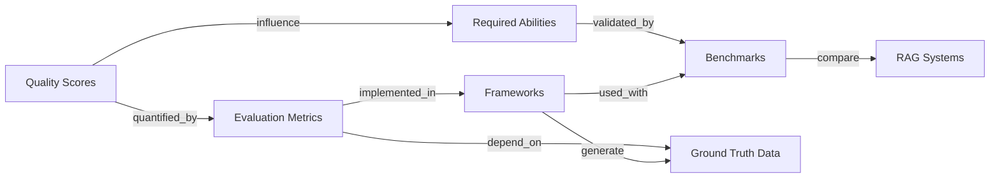

## Summary



**evaluation | info flow**:

1. _Quality Scores_ define what to measure

2. _Evaluation Metrics_ quantify those meanings

3. _Frameworks_ implement the measurements

4. _Benchmarks_ provide standardized datasets for comparison

5. _Required Abilities_ represent RAG capabilities validated through benchmarks

Use *frameworks* and *evaluation metrics* to evaluate the *3 quality scores* and *4 abilities*. Compare against *benchmarks*.

| Section                    | Are        | Purpose                                             | Subclasses                                                                                                                                                                                                                                                                                                                                                                      |
| -------------------------- | ---------- | --------------------------------------------------- | ------------------------------------------------------------------------------------------------------------------------------------------------------------------------------------------------------------------------------------------------------------------------------------------------------------------------------------------------------------------------------- |
| [[5.1-Quality-Scores]]     | Goals      | Define what “good” looks like (semantic dimensions) | (3) <abbr title="For a given query, how relevant is the retrieved info from KB?">context relevance</abbr>, <abbr title="Is LLM using the retrieved info?">answer faithfulness</abbr>, <abbr title="For a given query, how relevant is the system's answer?">answer relevance</abbr>                                                                                             |
| [[5.2-Evaluation-Metrics]] | Formulas   | Quantify the scores                                 | Retrieval Metrics, RAG-Specific Metrics                                                                                                                                                                                                                                                                                                                                         |
| [[5.3-Frameworks]]         | Tools      | Implement metrics in code                           | <abbr title="Retrieval-Augmented Generation Assessment">RAGAs</abbr>, <abbr title="Automated RAG evaluation system">ARES</abbr>                                                                                                                                                                                                                                                 |
| [[5.4-Benchmarks]]         | Datasets   | Supply shared test conditions                       | Classical QA, RAG-Specific, Domain-Specific                                                                                                                                                                                                                                                                                                                                     |
| [[5.5-Abilities]]          | Properties | Reflect core RAG capabilities                       | (4) <abbr title="Among KB docs related to Q, only want actionable ones.">Noise robustness</abbr>, <abbr title="If KB doesn't have relevant info, don't hallucinate.">Negative rejection</abbr>, <abbr title="If multiple KB docs, can RAG integrate?">Info integration</abbr>, <abbr title=" If info in KB is inaccurate, can RAG address it?">Counterfactual robustness</abbr> |

```
RAG Evaluation

├── 1. Quality Scores
│     ├── Context Relevance
│     ├── Answer Faithfulness
│     └── Answer Relevance
│
├── 2. Evaluation Metrics
│     ├── Retrieval Metrics
│     │     ├── Precision / Recall / F1
│     │     ├── Precision@k / MRR / MAP / nDCG
│     │     └── Accuracy
│     └── RAG-Specific Metrics (Quality Scores)
│
├── 3. Frameworks
│     ├── RAGAs
│     ├── ARES
│     ├── TruLens / DeepEval / RAGChecker
│     └── Ground Truth Generation
│
├── 4. Benchmarks
│     ├── Classical QA: SQuAD / HotpotQA / BEIR
│     ├── RAG-Specific: RGB / Multi-hop RAG / CRAG
│     └── Domain-Specific: MedRAG / CRUD-RAG / FeB4RAG
│
└── 5. Required Abilities
      ├── Noise Robustness
      ├── Negative Rejection
      ├── Information Integration
      └── Counterfactual Robustness

```