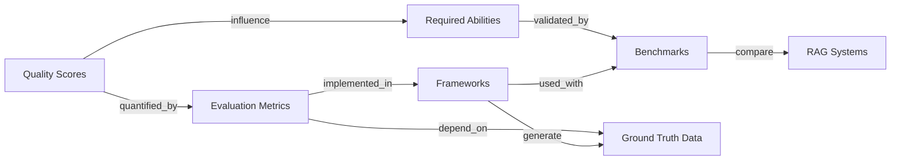

## Summary



**evaluation | info flow**:

1. _Quality Scores_ define what to measure

2. _Evaluation Metrics_ quantify those meanings

3. _Frameworks_ implement the measurements

4. _Benchmarks_ provide standardized datasets for comparison

5. _Required Abilities_ represent RAG capabilities validated through benchmarks

Use *frameworks* and *evaluation metrics* to evaluate the *3 quality scores* and *4 abilities*. Compare against *benchmarks*.

| Section                     | Are        | Purpose                                             | Subclasses                                                                                                                                                                                                                                                                                                                                                                      |
| --------------------------- | ---------- | --------------------------------------------------- | ------------------------------------------------------------------------------------------------------------------------------------------------------------------------------------------------------------------------------------------------------------------------------------------------------------------------------------------------------------------------------- |
| [[#5.1-Quality-Scores]]     | Goals      | Define what “good” looks like (semantic dimensions) | (3) <abbr title="For a given query, how relevant is the retrieved info from KB?">context relevance</abbr>, <abbr title="Is LLM using the retrieved info?">answer faithfulness</abbr>, <abbr title="For a given query, how relevant is the system's answer?">answer relevance</abbr>                                                                                             |
| [[#5.2-Evaluation-Metrics]] | Formulas   | Quantify the scores                                 | Retrieval Metrics, RAG-Specific Metrics                                                                                                                                                                                                                                                                                                                                         |
| [[#5.3-Frameworks]]         | Tools      | Implement metrics in code                           | <abbr title="Retrieval-Augmented Generation Assessment">RAGAs</abbr>, <abbr title="Automated RAG evaluation system">ARES</abbr>                                                                                                                                                                                                                                                 |
| [[#5.4-Benchmarks]]         | Datasets   | Supply shared test conditions                       | Classical QA, RAG-Specific, Domain-Specific                                                                                                                                                                                                                                                                                                                                     |
| [[#5.5-Abilities]]          | Properties | Reflect core RAG capabilities                       | (4) <abbr title="Among KB docs related to Q, only want actionable ones.">Noise robustness</abbr>, <abbr title="If KB doesn't have relevant info, don't hallucinate.">Negative rejection</abbr>, <abbr title="If multiple KB docs, can RAG integrate?">Info integration</abbr>, <abbr title=" If info in KB is inaccurate, can RAG address it?">Counterfactual robustness</abbr> |

```
RAG Evaluation

├── 1. Quality Scores
│     ├── Context Relevance
│     ├── Answer Faithfulness
│     └── Answer Relevance
│
├── 2. Evaluation Metrics
│     ├── Retrieval Metrics
│     │     ├── Precision / Recall / F1
│     │     ├── Precision@k / MRR / MAP / nDCG
│     │     └── Accuracy
│     └── RAG-Specific Metrics (Quality Scores)
│
├── 3. Frameworks
│     ├── RAGAs
│     ├── ARES
│     ├── TruLens / DeepEval / RAGChecker
│     └── Ground Truth Generation
│
├── 4. Benchmarks
│     ├── Classical QA: SQuAD / HotpotQA / BEIR
│     ├── RAG-Specific: RGB / Multi-hop RAG / CRAG
│     └── Domain-Specific: MedRAG / CRUD-RAG / FeB4RAG
│
└── 5. Required Abilities
      ├── Noise Robustness
      ├── Negative Rejection
      ├── Information Integration
      └── Counterfactual Robustness

```

### 5.1-Quality-Scores

!!! sam

    - **Definition**: Evaluate R & G outputs.

    - **Subclasses**:

        - **Context Relevance**

        - *Definition*: Degree of alignment between Q & retrieved context.

        - *Metrics*: Precision, Recall.

        - *Evaluated By*: Human annotation, semantic similarity, frameworks.

        - **Answer Faithfulness** (Groundedness)

        - *Definition*: Degree to which generated answer is factually supported by retrieved context.

        - *Inverse Metric*: Hallucination Rate.

        - *Related Metric*: Coverage (how much retrieved info appears in the answer).

        - **Answer Relevance**

        - *Definition*: How well the answer addresses the query semantically.

        - *Metric Type*: Similarity-based (e.g., cosine similarity of synthetic vs. original questions).

    - **Relations**:

        - `influences` ⟶ Frameworks

        - `depends_on` ⟶ R & G Components


[Figure 2.7 Evaluation proposed by TruEra.](https://learning.oreilly.com/api/v2/epubs/urn:orm:book:9781633435858/files/OEBPS/Images/CH02_F07_Kimothi.png)

### 5.2-Evaluation-Metrics

!!! sam

    - **Definition**: Quantitative functions measuring RAG performance.

    - **Categories**:

        - **Retrieval Metrics**

        - *Accuracy*: Correct retrieval proportion.

        - *Precision*: Relevance ratio among retrieved docs.

        - *Precision@k*: Precision among top-k retrieved results.

        - *Recall*: Coverage of all relevant docs.

        - *F1-Score*: Harmonic mean of Precision and Recall.

        - *Mean Reciprocal Rank (MRR)*: Rank position of first relevant result.

        - *Mean Average Precision (MAP)*: Combined precision over multiple cutoff points.

        - *nDCG*: Rank quality weighted by graded relevance.

        - **RAG-Specific Metrics**

        - *Context Relevance*

        - *Answer Faithfulness*

            - *Hallucination Rate*

            - *Coverage Score*

        - *Answer Relevance*

    - **Relations**:

        - `implemented_in` ⟶ Frameworks

        - `used_in` ⟶ Benchmarks


### 5.3-Frameworks

!!! sam

    - **Definition**: Tools that automate evaluation and data generation.

    - **Subclasses**:

        - <abbr title="Retrieval-Augmented Generation Assessment">RAGAs</abbr>

        - <abbr title="Automated RAG evaluation system">ARES</abbr>

        - Others: TruLens, DeepEval, RAGChecker

    - **Relations**:

        - `implements` ⟶ Evaluation Metrics

        - `supports` ⟶ Ground Truth Generation

        - `used_with` ⟶ Benchmarks


### 5.4-Benchmarks

!!! sam

    - **Definition**: Standardized datasets and tasks to compare RAG systems.

    - **Subclasses**:

        - **Classical**: SQuAD, HotpotQA, BEIR

        - **RAG-Specific Benchmarks**

        - **RGB**

            - *Focus*: Noise robustness, negative rejection, counterfactual robustness.

        - **Multi-hop RAG**

            - *Focus*: Multi-document reasoning (Inference, Comparison, Temporal, Null queries).

        - **CRAG**

            - *Focus*: Evaluating factual QA with diverse question types


### 5.5-Abilities

!!! sam

    - **Definition**: Functional capacities that determine robustness and utility of RAG systems.

    - **Subclasses**:

        - *Noise Robustness*: Ability to ignore irrelevant or weakly related documents.

        - *Related Component*: R.

        - *Negative Rejection*: Ability to respond with “I don’t know” when context lacks relevant info.

        - *Related Component*: G.

        - *Information Integration*: Ability to synthesize answers from multiple sources.

        - *Counterfactual Robustness*: Ability to reject incorrect or contradictory context.

    - **Additional Attributes**: *Latency*, *Bias & Toxicity*, *Robustness*