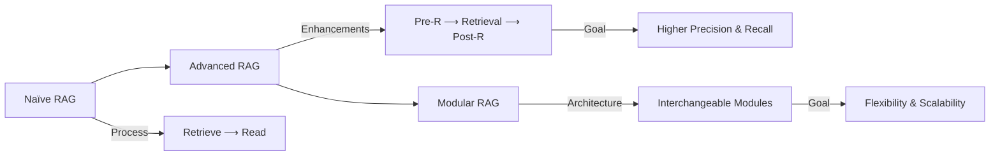

### Summary

**RAG System**

- subtypes ⟶ {Naïve, Advanced, Modular}

- pipelines ⟶ {Indexing, Generation}

!!! sam
    [[#1. Naïve]]

    - **implements_framework**: Retrieve ⟶ Read

    [[#2. Advanced]]

    - **extends**: Naïve

    - **implements_framework**: *Rewrite* ⟶ Retrieve ⟶ *Re-rank* ⟶ Read

    - **composed_of_stages**: {**Pre-R**, **Retrieval**, **Post-R**}

    - **aims_to** ⟶ improve precision, recall, and contextual alignment

    [[#3. Modular]]

    - **extends** ⟶ Advanced RAG

    - **decomposes_into_modules** ⟶ {**Core**, **New**}

---

### 1. Naïve
**Limitations**

- **R** ⟶ {low precision, low recall}

- **A** ⟶ {redundancy, disjoint context, context length limits}

- **G** ⟶ {hallucination, bias, overreliance on retrieved context}

### 2. Advanced
#### *2.1 Pre-R Stage*

- **Index Optimization**: Optimize our KB.

- **Query Optimization**: Optimize our user Q before retrieval.

!!! sam
    **Index Optimization**

    - **Chunk**: <abbr title="Small chunks increase precision but lose context.">Chunk Size Tuning</abbr> · <abbr title="Add a brief summary of the larger doc to each chunk to improve coherence and retrieval accuracy.">Context-Enriched Chunking</abbr> · <abbr title="Retrieve both the matched chunks and their neighbors to preserve flow and context in long docs.">Surrounding-Chunk Retrieval</abbr>

    - **Metadata**: <abbr title="Use structured attributes to filter chunks before similarity search; reduces noise and boosts relevance.">Metadata Filtering</abbr> · <abbr title="Augment chunks with richer fields (even synthetic/derived) to improve semantic matching during retrieval.">Metadata Enrichment</abbr>

    - **Index**: <abbr title="Organize docs hierarchically so retrieval can combine detailed child content with broader parent context.">Parent-Child Hierarchy</abbr> · <abbr title="Represent entities and relations (GraphRAG) to enable reasoning, disambiguation, and explainability.">Knowledge Graph Index</abbr>

!!! sam
    **Query Optimization**

    - **Query Expansion**: <abbr title="Generate multiple semantically varied queries from the same user input to improve recall.">Multi-Query</abbr> · <abbr title="Decompose a complex question into smaller, focused sub-queries that retrieve different facets of the answer.">Sub-Query</abbr> · <abbr title="Ask a higher-level or more general version of the question first, then step back to the original for better coverage.">Step-Back</abbr>

    - **Query Transformation**: <abbr title="Rephrase or reformulate the query (often via LLM) to better match document phrasing and intent.">Rewrite</abbr> · <abbr title="Generate a hypothetical answer and embed it as the query (Hypothetical Document Embedding) to enhance semantic retrieval.">HyDE</abbr>

    - **Query Routing**: <abbr title="Route the query based on inferred intent (e.g., factual vs. reasoning) to specialized retrievers or models.">Intent-Based</abbr> · <abbr title="Use metadata (like source, author, or time) to direct the query to specific filtered indexes.">Metadata-Based</abbr> · <abbr title="Select the retriever or index whose embedding space best matches the query’s semantic profile.">Semantic-Based</abbr>

#### *2.2 Retrieval Stage*
!!! sam
    - **uses_strategies**:

        - **Hybrid R** ⟶ combines sparse + dense + graph retrieval

        - **Iterative R** ⟶ loops retrieval using generated outputs

        - **Recursive R** ⟶ transforms query iteratively

        - **Adaptive R** ⟶ employs LLMs to decide when/what to retrieve

        - **is_a_subtype_of** ⟶ Agentic AI

#### *2.3 Post-R Stage*
!!! sam
    - **includes**:

        - **Compression** ⟶ removes irrelevant tokens, fits LLM context window

        - **Re-ranking** ⟶ prioritizes retrieved docs for generation

---

### 3. Modular

- **extends** ⟶ Advanced RAG

- **decomposes_into_modules** ⟶ {**Core**, **New**}

#### 3.1 Core
!!! sam
    Modules:

    - **I** ⟶ builds KB, manages embeddings & chunking

    - **R** ⟶ enables interchangeable retrievers

    - **G** ⟶ manages LLM selection & prompt augmentation

    - **Pre-R** ⟶ encapsulates Pre-R techniques

    - **Post-R** ⟶ encapsulates Post-R techniques

#### 3.2 New
!!! sam
    - **Search** ⟶ expands access to multiple data sources

    - **Fusion** ⟶ aggregates multi-query results

    - **Memory** ⟶ leverages LLM parametric memory

    - **Routing** ⟶ directs queries through optimal paths

    - **Task Adapter** ⟶ adapts system for specific downstream tasks