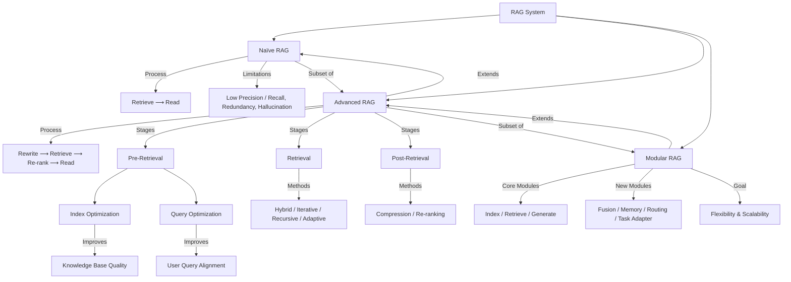

Ontology: Advanced and Modular RAG Systems



```
├── 1. RAG System
│     ├── 1.1 Naïve RAG
│     │     ├── Process: Retrieve ⟶ Read
│     │
│     ├── 1.2 Advanced RAG
│     │     ├── Process: Rewrite ⟶ Retrieve ⟶ Re-rank ⟶ Read
│     │     ├── Pre-R Techniques
│     │     │     ├── Index Opt
│     │     │     └── Query Opt
│     │     │
│     │     ├── Retrieval Strategies
│     │     │     ├── Hybrid
│     │     │     ├── Iterative
│     │     │     ├── Recursive
│     │     │     └── Adaptive
│     │     │
│     │     ├── Post-R Techniques
│     │     │     ├── Compression
│     │     └──   └── Re-ranking
│     │
│     └── 1.3 Modular RAG
│           ├── Core Modules
│           │     ├── I
│           │     ├── R
│           │     ├── G
│           │     ├── Pre-R
│           │     └── Post-R
│           │
│           ├── New Modules
│           │     ├── Search
│           │     ├── Fusion (multi-query merging)
│           │     ├── Memory (LLM internal recall)
│           │     ├── Routing (query path selection)
│           │     └── Task Adapter (downstream adaptation)
│           │
│           └── Design Principles
│                 ├── Modular & Interchangeable Components
│                 ├── Clear Interfaces (inputs / outputs)
│                 ├── Orchestration Layer for Mixing Modules
└──               └── Tradeoff: Flexibility ↔ Complexity

```

## Summary

**RAG System**

- **has_subtypes** ⟶ {**Naïve**, **Advanced**, **Modular**}

- **has_pipelines** ⟶ {**Indexing**, **Generation**}

#### 1. **Naïve**

- **implements_framework** ⟶ “Retrieve ⟶ Read”

- **has_limitations**

  - **R Failures** ⟶ {low precision, low recall}

  - **A Issues** ⟶ {redundancy, disjoint context, context length limits}

  - **G Errors** ⟶ {hallucination, bias, overreliance on retrieved context}

#### [[#2. Advanced]]

- **extends** ⟶ Naïve

- **implements_framework** ⟶ “*Rewrite* ⟶ Retrieve ⟶ *Re-rank* ⟶ Read”

- **composed_of_stages** ⟶ {**Pre-R**, **Retrieval**, **Post-R**}

- **aims_to** ⟶ improve precision, recall, and contextual alignment

#### [[#3. Modular]]

- **extends** ⟶ Advanced RAG

- **decomposes_into_modules** ⟶ {**Core**, **New**}

---

### Details

#### 2. Advanced

##### *2.1 Pre-R Stage*

- **includes** ⟶ {**Index Optimization**, **Query Optimization**}

**2.1.1 Index Optimization**
!!! sam
    - **optimizes** ⟶ KB structure

    - **has_strategies**

        - **Chunk Optimization** ⟶ {Chunk Size Tuning, Context-Enriched Chunking, Surrounding-Chunk Retrieval}

        - **Metadata Enhancement** ⟶ {Metadata Filtering, Metadata Enrichment}

        - **Index Structure** ⟶ {Parent-Child Hierarchy, Knowledge Graph Index}


**Chunk Optimization**

* **Chunk Size Tuning**: Small chunks increase precision but lose context.

* **Context-Enriched Chunking**: Add brief summary of larger doc to each chunk. Improves coherence & retrieval accuracy.

* **Surrounding-Chunk Retrieval**: Retrieve matched & neighboring chunks. Preserves flow and context in long docs.

**Metadata Enhancement**

* **Metadata Filtering**: Use attributes to filter chunks before similarity search. Reduces noise & improves relevance.

* **Metadata Enrichment**: Add metadata to improve semantic matching during retrieval. (Metadata could be synthetic or derived.)

**Index Structure**

* **Parent-Child Hierarchy**: Organizes docs hierarchically so retrieval can combine detailed “child” content with broader “parent” context.

* **Knowledge Graph Index**: Structures information as entities and relationships (GraphRAG), enabling reasoning, disambiguation, and explainability.

**2.1.2 Query Optimization**
!!! sam
    - **optimizes** ⟶ Q before retrieval

    - **has_methods**

        - **Query Expansion** ⟶ {Multi-Query, Sub-Query, Step-Back}

        - **Query Transformation** ⟶ {Rewrite, HyDE}

        - **Query Routing** ⟶ {Intent-Based, Metadata-Based, Semantic-Based}


##### *2.2 Retrieval Stage*
!!! sam
    - **uses_strategies**:

        - **Hybrid R** ⟶ combines sparse + dense + graph retrieval

        - **Iterative R** ⟶ loops retrieval using generated outputs

        - **Recursive R** ⟶ transforms query iteratively

        - **Adaptive R** ⟶ employs LLMs to decide when/what to retrieve

        - **is_a_subtype_of** ⟶ Agentic AI


##### *2.3 Post-R Stage*
!!! sam
    - **includes**:

        - **Compression** ⟶ removes irrelevant tokens, fits LLM context window

        - **Re-ranking** ⟶ prioritizes retrieved docs for generation


---

#### 3. Modular

- **extends** ⟶ Advanced RAG

- **decomposes_into_modules** ⟶ {**Core**, **New**}

##### 3.1 **Core**
!!! sam
    Modules:

    - **I** ⟶ builds KB, manages embeddings & chunking

    - **R** ⟶ enables interchangeable retrievers

    - **G** ⟶ manages LLM selection & prompt augmentation

    - **Pre-R** ⟶ encapsulates Pre-R techniques

    - **Post-R** ⟶ encapsulates Post-R techniques


##### 3.2 **New**
!!! sam
    - **Search** ⟶ expands access to multiple data sources

    - **Fusion** ⟶ aggregates multi-query results

    - **Memory** ⟶ leverages LLM parametric memory

    - **Routing** ⟶ directs queries through optimal paths

    - **Task Adapter** ⟶ adapts system for specific downstream tasks